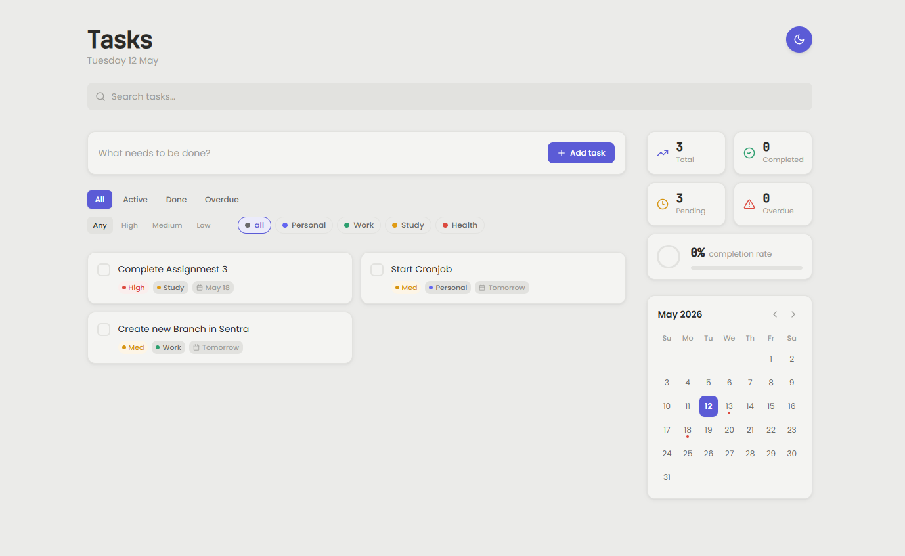
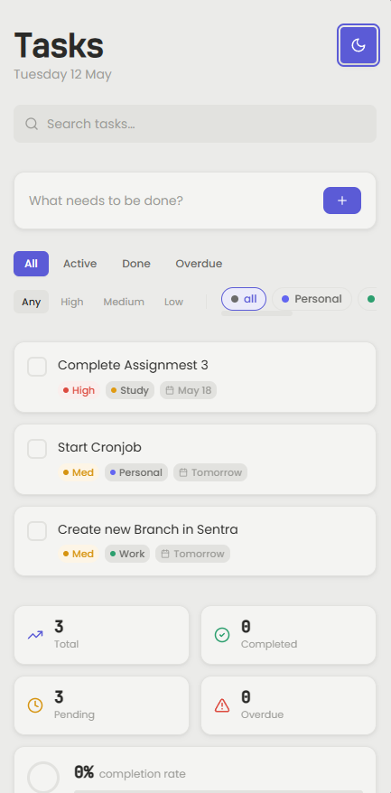
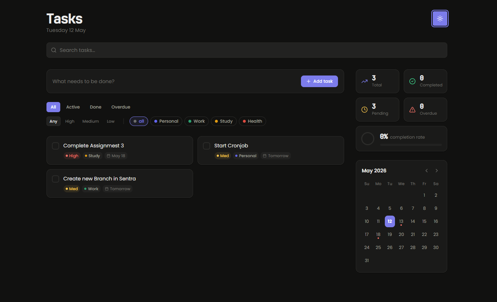
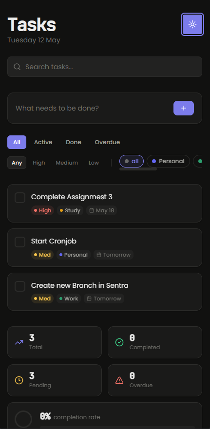

<div align="center">

# Task Manager

**Full-stack Task Manager app built for an internship screening assignment using React, Node.js, Express, and SQLite with a modern UI, responsive design, animations, and CRUD features.**

[](https://github.com/Prathmesh-D)
[](https://www.linkedin.com/in/prathmesh-deshkar)
[](https://tinyurl.com/PrathmeshDeshkarResume)
[](mailto:pdeshkar350@gmail.com)

</div>

---

<div align="center">

## Screenshots

<table>
  <tr>
    <td align="center"><b>🖥️ Desktop — Light</b></td>
    <td align="center"><b>📱 Mobile — Light</b></td>
  </tr>
  <tr>
    <td></td>
    <td></td>
  </tr>
  <tr>
    <td align="center"><b>🖥️ Desktop — Dark</b></td>
    <td align="center"><b>📱 Mobile — Dark</b></td>
  </tr>
  <tr>
    <td></td>
    <td></td>
  </tr>
</table>

</div>

## What's Inside

This isn't a basic to-do list. It's a complete full-stack application with a real REST API, persistent SQLite database, and a thoughtfully designed UI, built to demonstrate production-level thinking within the scope of a screening assignment.

```
React frontend  →  Express REST API  →  SQLite database
     ↑
Framer Motion animations
Tailwind CSS custom design system
Light / Dark theming
```

---

## Features

| | Feature | Details |
|---|---|---|
| ✏️ | **Task CRUD** | Add, edit, delete, complete, all inline, no modals |
| 📊 | **Live Dashboard** | Total, completed, pending, overdue stats + completion rate ring |
| 🗂️ | **Kanban Grid** | Responsive — list on mobile, multi-column grid on desktop |
| 📅 | **Interactive Calendar** | Highlights due dates; click any date to pre-fill a task |
| 🔍 | **Multi-filter** | Filter by status, priority, and category simultaneously |
| 🌗 | **Light / Dark Mode** | Full theme support with semantic color palette |
| 💾 | **Persistent Storage** | SQLite — tasks survive page refresh and server restart |

---

## Tech Stack

<table>
<tr>
<td valign="top" width="50%">

**Frontend**

| Tool | Role |
|---|---|
| React 18 | UI framework |
| Vite | Build tool & dev server |
| Tailwind CSS | Custom design system |
| Framer Motion | Animations & transitions |
| Lucide React | Icons |

</td>
<td valign="top" width="50%">

**Backend**

| Tool | Role |
|---|---|
| Node.js | Runtime |
| Express.js | REST API |
| SQLite | File-based database |
| CORS | Cross-origin support |

</td>
</tr>
</table>

---

## Getting Started

> No database setup required. SQLite creates `tasks.db` automatically on first run.

**Requires:** Node.js v16+

### 1. Clone the repo

```bash
git clone https://github.com/Prathmesh-D/TaskManagerApp.git
cd task-manager
```

### 2. Install dependencies

```bash
npm run install:all
```

> Installs both frontend and backend dependencies in one step.

### 3. Start the app

```bash
npm start
```

> Runs the Express server on `:3001` and Vite dev server on `:5173` concurrently.

### 4. Open in browser

```
http://localhost:5173
```

---

## API Reference

**Base URL:** `http://localhost:3001`

| Method | Endpoint | Body | Description |
|---|---|---|---|
| `GET` | `/api/tasks` | — | Fetch all tasks |
| `POST` | `/api/tasks` | `{ title }` | Create a new task |
| `PATCH` | `/api/tasks/:id` | `{ title?, completed? }` | Update title or status |
| `DELETE` | `/api/tasks/:id` | — | Delete a task |

All responses are JSON. Errors return `{ "error": "message" }` with the appropriate HTTP status.

---

## Project Structure

```
task-manager/
├── backend/
│   ├── db/
│   │   └── database.js        # SQLite connection + schema init
│   ├── routes/
│   │   └── tasks.js           # CRUD route handlers
│   └── server.js              # Express entry point
│
├── frontend/
│   ├── src/
│   │   ├── api/
│   │   │   └── tasks.js       # Fetch wrappers for every endpoint
│   │   ├── components/
│   │   │   ├── TaskInput.jsx
│   │   │   ├── TaskList.jsx
│   │   │   ├── TaskItem.jsx
│   │   │   ├── FilterBar.jsx
│   │   │   ├── TaskStats.jsx
│   │   │   └── Toast.jsx
│   │   ├── hooks/
│   │   │   └── useTasks.js    # Data fetching + optimistic updates
│   │   ├── utils/
│   │   │   └── helpers.js
│   │   └── App.jsx
│   └── vite.config.js
│
├── package.json               # Root scripts: install:all, start
└── README.md
```

---

## Engineering Decisions

**Optimistic updates**
The UI updates instantly on every action. If the API call fails, the change reverts automatically, so the app never feels slow or broken.

**No modal dialogs**
All editing happens inline in the task row. Modals interrupt focus, inline editing keeps the user in context.

**SQLite over in-memory state**
Tasks persist across refresh and server restarts without any external database setup. The entire project runs with a single `npm start` -- no Postgres, no Docker, no config files.

**`useTasks` as a single source of truth**
All data fetching and mutation logic lives in one custom hook. Components stay purely presentational, easier to read, easier to test, easier to extend.

---

<div align="center">

Made by [Prathmesh Deshkar](https://github.com/Prathmesh-D)

</div>